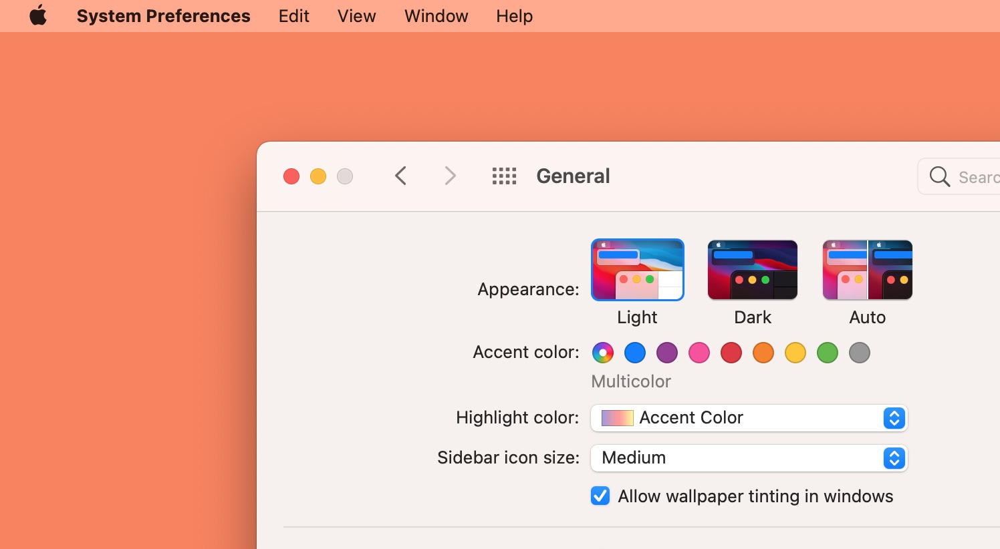
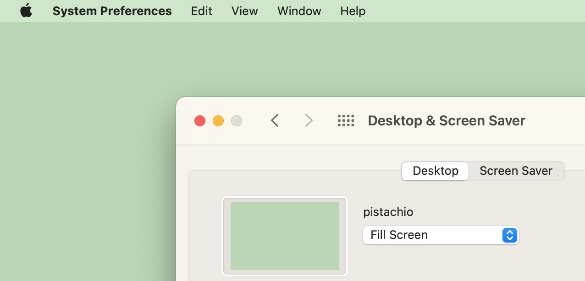
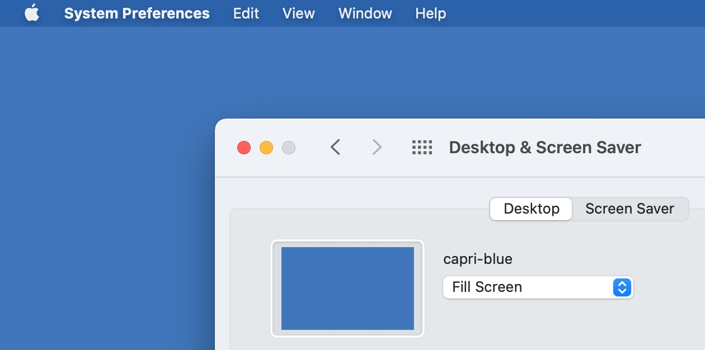
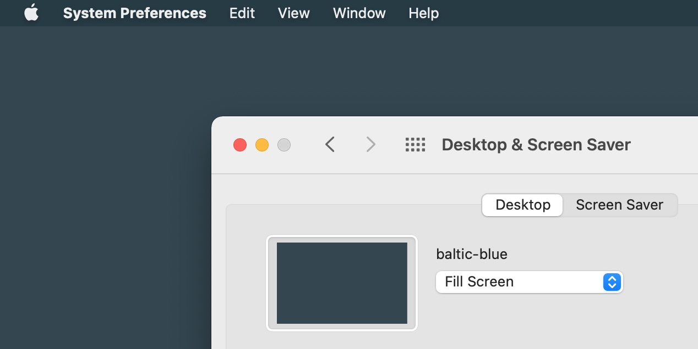
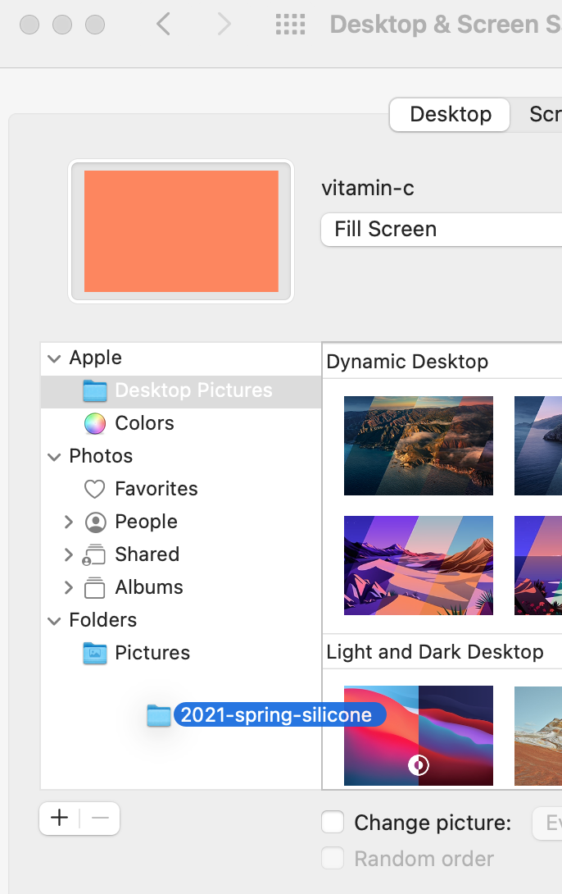
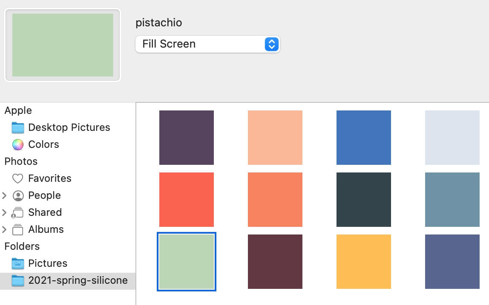

# TiffTheSeason
Desktop pictures based on Apple seasonal products (watch bands, phone cases, …)

Do you wish your Mac's desktop picture popped like an Apple Watch Solo Loop? Or felt classy like an iPhone 11 Pro Leather Folio?

What if it looked more like these?

Apple has been releasing accessories (bands for the Apple Watch, cases for iPhones and iPads, etc.) on a semiannual schedule; spring and fall fashion collections, if you will. Many of those are great colors — why not have them on your Mac?

# Install

1. Download the latest release.

The zip file contains folders of single-color images, organized by releases of Apple accessory collections, and by material (either leather or silicone), e.g. `2019-fall-silicone` for all colors of silicone bands and cases.

2. Open System Preferences, Desktop & Screen Saver.

3. Drag one or more folders from the zip archive in the left panel, or add by clicking the **+** button:

This will add those folders to, well, the **Folders** section. And then you can simply pick one:

That's it! You've picked a lovely color there. 🙂

# FAQ

<dl>
<dt>Can't I put them in subfolders?</dt>
<dd>It seems Apple dosn't support that, alas.
<dt>Does it work on iOS?</dt>
<dd>I haven't tried, but I believe you can't add entire collections of images to iOS. You can always, of course, add single images.</dd>
<dt>Does it work on Windows, Linux with GNOME, my pet platform?</dt>
<dd>Probably. If there's some special image collection format for those or some other requirements, please do let me know by writing an issue.</dd>
</dl>

# Credits

The watch bands, phone cases, and other accessories are copyright &copy; Apple Inc. The color names may be trademarks of Apple Inc. No infringement is intended.

Research was greatly helped by MacRumors's extensive coverage, including at: https://www.macrumors.com/guide/apple-watch-bands/.

[The Internet Archive](https://archive.org) has helped me recover some older color swatches.
